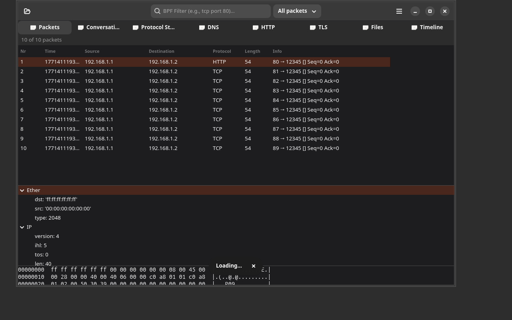

# PacketLens

## Screenshot



[](https://github.com/yeager/pcap-viewer/releases)
[](LICENSE)
[](https://app.transifex.com/danielnylander/packetlens/)

A comprehensive GTK4/Adwaita network capture analyzer for Linux with advanced protocol analysis, file extraction, and security inspection.

## Features

- **Packet Browser** — Three-pane Wireshark-style layout with packet list, protocol layers, and hex dump
- **Protocol Statistics** — Visual breakdown with cairo charts, top talkers, traffic distribution
- **Conversation Analysis** — Track network flows between endpoints with byte/packet counts
- **DNS Analysis** — Query/response log, domain tracking, DNS-over-HTTPS detection
- **HTTP Analysis** — Request/response extraction, header inspection, content preview
- **TLS Analysis** — Certificate inspection, cipher suite analysis, security assessment
- **File Extraction** — Extract files from HTTP/FTP transfers with image preview
- **Timeline View** — Chronological bandwidth graphs and event visualization
- **BPF Filtering** — Advanced Berkeley Packet Filter with preset combinations
- **Drag & Drop** — Drop pcap/pcapng files directly into the window
- **Preferences** — Color scheme (light/dark/system), max packet display, DNS name resolution
- **Keyboard Shortcuts** — Ctrl+O open, Ctrl+Q quit, F5 refresh
- **Internationalized** — 18 languages via Transifex, Swedish 100% translated

## Screenshots

### Main Packet View

*Three-pane interface with packet list, protocol layers, and hex dump*

### Protocol Statistics

*Visual breakdown of protocol distribution and traffic patterns*

### Conversation Analysis

*Network flows between endpoints with detailed statistics*

### DNS Analysis

*DNS query/response tracking and domain analysis*

### HTTP Analysis

*HTTP request/response extraction and header inspection*

### TLS Analysis

*Certificate inspection and cipher suite analysis*

### File Extraction

*Extract files transferred over the network*

### Timeline View

*Chronological visualization of network events and bandwidth*

## Installation

### Debian/Ubuntu

```bash
curl -fsSL https://yeager.github.io/debian-repo/KEY.gpg | sudo gpg --dearmor -o /usr/share/keyrings/yeager-archive-keyring.gpg
echo "deb [signed-by=/usr/share/keyrings/yeager-archive-keyring.gpg] https://yeager.github.io/debian-repo stable main" | sudo tee /etc/apt/sources.list.d/yeager.list
sudo apt update
sudo apt install packetlens
```

### Fedora/RHEL

```bash
sudo dnf config-manager --add-repo https://yeager.github.io/rpm-repo/yeager.repo
sudo dnf install packetlens
```

### From source

```bash
pip install .
packetlens
```

## Dependencies

- Python 3.10+
- GTK 4, libadwaita
- Scapy (packet parsing)
- python-magic (file type detection)

## Man page

```bash
man packetlens
```

## 🌍 Contributing Translations

Help translate PacketLens into your language on Transifex!

**[→ Translate on Transifex](https://app.transifex.com/danielnylander/packetlens/)**

Currently 18 languages: Arabic, Czech, Danish, German, Spanish, Finnish, French, Italian, Japanese, Korean, Norwegian Bokmål, Dutch, Polish, Brazilian Portuguese, Russian, Swedish (100%), Ukrainian, Chinese (Simplified).

### For Translators
1. Create a free account at [Transifex](https://www.transifex.com)
2. Join the [danielnylander](https://app.transifex.com/danielnylander/) organization
3. Start translating!

Translations are automatically synced via GitHub Actions.

## License

GPL-3.0-or-later — Daniel Nylander <daniel@danielnylander.se>
